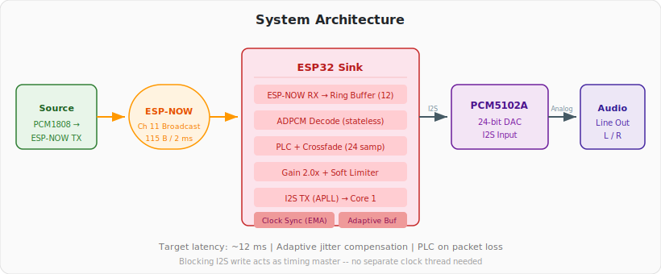
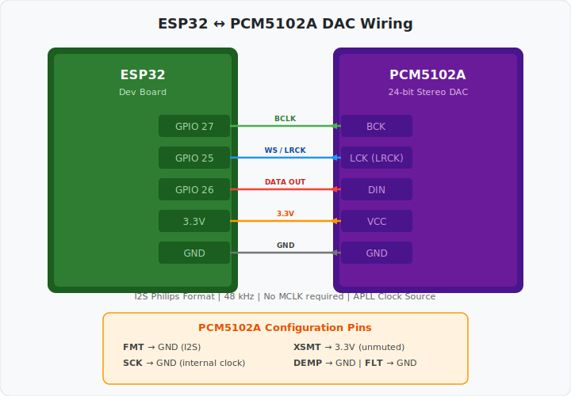

# ESP-NOW Audio Sink

Wireless audio receiver built on the ESP32. Receives IMA ADPCM audio packets over ESP-NOW, decodes them, and plays stereo 24-bit audio through a PCM5102A DAC over I2S. Designed to pair with the [ESP-NOW Audio Source](https://github.com/WillyBilly06/esp-now-audio-source) transmitter.

---

## Architecture

<p align="center">
  
</p>

---

## Overview

This is the receiving half of a wireless audio link. The sink listens for broadcast ESP-NOW packets from the source, decodes the IMA ADPCM payload back to 24-bit PCM, applies gain and soft limiting, and writes the result to a PCM5102A DAC over I2S in real-time.

The whole pipeline is built around low latency. Blocking I2S writes act as the timing master, a small ring buffer absorbs jitter, and a clock-sync algorithm tracks the source timestamp to keep playback lag around 12 ms. If a packet is late or lost, the last decoded frame is replayed as basic packet loss concealment (PLC), with a short crossfade when real audio resumes.

### Key specs

| Parameter              | Value                                |
|------------------------|--------------------------------------|
| Sample rate            | 48 kHz                               |
| Bit depth              | 24-bit (I2S 32-bit slot, MSB-aligned)|
| Channels               | 2 (stereo)                           |
| Codec                  | IMA ADPCM, interleaved L/R nibbles   |
| Frame size             | 96 samples (~2 ms)                   |
| Ring buffer            | 12 slots                             |
| Prebuffer              | 1 frame before unmute                |
| Target playback lag    | ~12 ms                               |
| Output gain            | 2.0x with soft limiter               |
| PLC                    | Last-frame repeat + crossfade blend  |
| Clock source           | APLL (low-jitter)                    |

---

## Hardware

### Components

- **ESP32 dev board** (dual-core, any variant with enough GPIOs)
- **PCM5102A DAC module** -- stereo 24-bit audio DAC, I2S input

### Wiring

<p align="center">
  
</p>

| PCM5102A Pin | ESP32 GPIO | Function         |
|--------------|------------|------------------|
| BCK          | GPIO 27    | Bit clock        |
| LCK (LRCK)  | GPIO 25    | Word select      |
| DIN          | GPIO 26    | Serial data out  |
| VCC          | 3.3V       | Power            |
| GND          | GND        | Ground           |

Additional PCM5102A configuration pins:

| PCM5102A Pin | Connection | Notes                                    |
|--------------|------------|------------------------------------------|
| FMT          | GND        | I2S / Philips format                     |
| SCK          | GND        | System clock derived internally          |
| XSMT         | 3.3V       | Soft mute off (output always active)     |
| DEMP         | GND        | De-emphasis filter disabled              |
| FLT          | GND        | Normal latency filter                    |

---

## Requirements

- **ESP-IDF v5.5.2**
- An ESP32 target (not ESP32-S3). The project is configured for plain ESP32 in `sdkconfig.defaults`.

---

## Build and Flash

```bash
# Set up ESP-IDF environment (adjust path to your installation)
. $HOME/esp/esp-idf/export.sh

# Build
idf.py build

# Flash (replace /dev/ttyUSB0 with your port)
idf.py -p /dev/ttyUSB0 flash

# Monitor serial output
idf.py -p /dev/ttyUSB0 monitor
```

On Windows with PowerShell:

```powershell
D:\esp-idf\export.ps1
idf.py build
idf.py -p COMXX flash monitor
```

---

## Configuration

All tunable values are `#define` constants at the top of `main/main_adpcm.c`:

### Audio / I2S

| Define                | Default     | Description                                      |
|-----------------------|-------------|--------------------------------------------------|
| `SAMPLE_RATE`         | 48000       | Must match the source                            |
| `PIN_BCLK`            | GPIO 27     | I2S bit clock                                    |
| `PIN_WS`              | GPIO 25     | I2S word select                                  |
| `PIN_DOUT`            | GPIO 26     | I2S serial data to PCM5102A                      |
| `OUTPUT_GAIN_NUM`     | 4           | Gain numerator (4/2 = 2.0x gain)                 |
| `OUTPUT_GAIN_DEN`     | 2           | Gain denominator                                 |
| `LIMITER_THRESHOLD`   | 6000000     | Soft limiter knee (24-bit scale)                  |

### Network

| Define                | Default     | Description                                      |
|-----------------------|-------------|--------------------------------------------------|
| `WIFI_CHANNEL`        | 11          | Must match the source                            |
| `AUDIO_MAGIC`         | 0xAD        | Packet marker byte                               |

### Buffering and Timing

| Define                | Default     | Description                                      |
|-----------------------|-------------|--------------------------------------------------|
| `PACKET_RING_SIZE`    | 12          | Ring buffer capacity (frames)                    |
| `PREBUFFER_FRAMES`    | 1           | Frames buffered before unmuting                  |
| `TARGET_BUF_FILL`     | 1           | Steady-state queue depth target                  |
| `TARGET_BUF_FILL_MAX` | 2           | Queue target under jitter                        |
| `PACKET_WAIT_MS`      | 1           | Normal wait before PLC fallback                  |
| `PACKET_WAIT_MS_MAX`  | 2           | Wait under jitter                                |
| `TARGET_PLAY_LAG_US`  | 12000       | Target source-to-play latency (microseconds)     |
| `MAX_PLAY_LAG_US`     | 17000       | Hard lag ceiling -- drops frames above this       |
| `MIN_PLAY_LAG_US`     | 9000        | Low lag boundary                                 |
| `SOURCE_TIMEOUT_US`   | 120000      | Silence timeout -- resets stream after 120 ms     |
| `CROSSFADE_SAMPLES`   | 24          | Blend length after PLC recovery                  |

---

## How It Works

### Receive Path

1. **ESP-NOW callback** -- When a packet arrives, the callback does minimal work: validates the magic byte and size, copies the packet into the ring buffer, and notifies the playback task. No decoding happens here.

2. **Clock sync** -- Each received packet carries the source's microsecond timestamp. The callback tracks the offset between source and sink clocks using an exponential moving average (alpha = 1/16). Large jumps (source reboot) trigger a full reset. The playback task uses the drift and jitter values to decide when to drop frames.

### Playback Path

3. **Startup** -- The playback task waits until at least 1 frame is queued (prebuffer), trims any excess to keep buffer fill at the target level, then enables I2S output and starts decoding.

4. **ADPCM decode** -- The decoder initializes its predictor state from the packet header (no inter-packet dependency), then decodes 96 interleaved nibble-pairs back to 24-bit stereo PCM.

5. **PLC** -- If no packet is available within the adaptive wait window, the last decoded frame is replayed. When a real packet arrives after a PLC burst, a short crossfade (24 samples) blends the transition to avoid clicks.

6. **Output gain and limiting** -- Decoded PCM is scaled by the output gain (default 2.0x), then passed through a soft limiter (knee at ~71% of full scale, 4:1 ratio above knee) to prevent clipping.

7. **I2S write** -- 24-bit samples are MSB-aligned into 32-bit I2S slots and written to the PCM5102A. The blocking `i2s_channel_write` call is the timing master for the entire pipeline.

### Adaptive Buffering

8. **Jitter response** -- The status task (every 5 seconds) monitors underrun rate. If underruns are frequent, the target buffer fill and packet wait are temporarily increased. After 3 stable windows with zero underruns, they return to the low-latency defaults.

9. **Lag control** -- The playback task compares the current play lag against the target. If lag exceeds the ceiling, queued frames are dropped to catch up. This prevents the buffer from growing unbounded under sustained clock drift.

---

## Serial Output

At runtime the status task logs something like:

```
I (5000) ADPCM_SINK: rx=940(188/s) play=938(187/s) q=1 drop=2 und=0 lat=7ms lag=11500us off=0us jit=50us sdrop=0 shold=0 tf=1 wait=1ms
```

| Field     | Meaning                                          |
|-----------|--------------------------------------------------|
| `rx`      | Total packets received (rate per second)         |
| `play`    | Total frames played (rate per second)            |
| `q`       | Current ring buffer fill                         |
| `drop`    | Packets dropped (overflow or sync trim)          |
| `und`     | Underruns (PLC activations)                      |
| `lat`     | Estimated sink-side latency (queue + DMA)        |
| `lag`     | Source-to-play lag in microseconds               |
| `off`     | Clock drift from initial offset                  |
| `jit`     | Smoothed clock jitter                            |
| `sdrop`   | Sync-related frame drops                         |
| `shold`   | Sync-related frame holds                         |
| `tf`      | Current adaptive target fill                     |
| `wait`    | Current adaptive packet wait                     |

---

## Project Structure

```
esp-now-audio-sink/
  CMakeLists.txt            Root project file
  sdkconfig.defaults        ESP32 build defaults (240 MHz, WDT, Wi-Fi buffers)
  main/
    CMakeLists.txt           Component registration
    idf_component.yml        IDF component dependencies
    main_adpcm.c             All source code (receive, decode, playback, sync)
  docs/
    images/                  Component photos for reference
```

---

## License

This project is provided as-is for personal and educational use.
